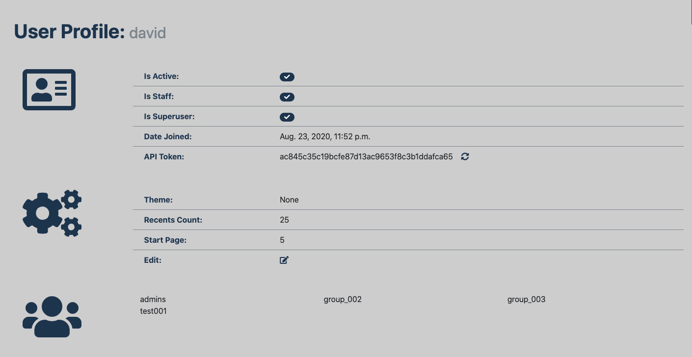
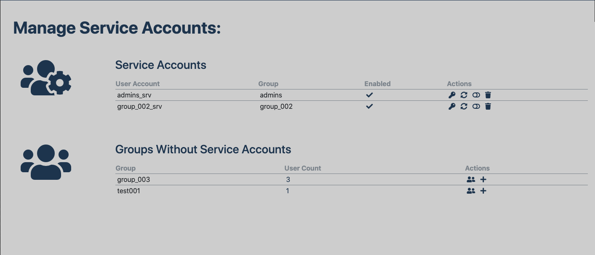

.. _features:

Features
========

This document details the features currently available in django-userextensions.

log-in redirect
---------------
Users can define a specific page to be routed to after login. This is set in the UserPreference model with the
start_page field. When configured, the page specified will be displayed after the user logs in. If no start_page for
the user is set, the value set in the ``LOGIN_REDIRECT_URL_DEFAULT`` parameter in settings.py will be used. If the
LOGIN_REDIRECT_URL_DEFAULT is not set, the project root ``'/'`` will be used.
the project root will be displayed after login.

Start page can be set using the ``SetStartPage`` view, available via the
``userextensions:set_start_page`` URL. When called, the referred URL will be set as the users start page. To enable
this feature, ensure the three configuration steps below.

1. add 'userextensions' to the INSTALLED_APPS:

.. code-block:: python

    INSTALLED_APPS = [
        ...
       'userextensions',
    ]
..

2. set the ``LOGIN_REDIRECT_URL`` parameter in your settings.py file:

.. code-block:: python

    LOGIN_REDIRECT_URL = '/userextensions/user_login_redirect'
    LOGIN_REDIRECT_URL_DEFAULT = '/'
..

3. include the userextensions.urls your project-level urls.py file:

.. code-block:: python

    from userextensions.urls import *

    urlpatterns = [
        ...
        path('', include('userextensions.urls'), ),
    ]
..

user-defined favorites
----------------------
This application allows for users to add URLs as favorites, which capture the full URL including query parameters. A
favorite can be saved by using the ``AddFavorite`` view, accessible from the ``userextensions:add_favorite`` URL.
Favorites can be deleted by using the ``DeleteFavorite`` view, accessible from the ``userextensions:delete_favorite``
URL. Additionally, there is a ``ListFavorites`` view available at ``userextensions:list_favorites`` that uses a Twitter
Bootstrap based table to list a users favorites.

recently viewed URLs
--------------------
Recently viewed URLs (recents) can by tracked for users automatically using the included middleware. Users can
individuallyconfigure the number of recents to track via recents_count field in the UserPreference model; this defaults
to 25. Specific static URLs, or URLs with a particular prefix can be excluded by adjusting the ``SKIP_URL_PREFIX_LIST``
and ``SKIP_FIXED_URL_LIST`` parameters in the settings.py file. URLs stored in recents can also be filtered by http
request methods. By default only ``GET`` is enabled. This can be modified by changing the ``TRACK_METHOD_LIST``
parameter in the settings.py file. Additionally, there is a ``ListRecents`` view available at
``userextensions:list_recents`` that uses a Twitter Bootstrap based table to list a users favorites.

To enable recents tracking, ensure the three configuration steps below.

1. add the middleware in settings.py:

.. code-block:: python

    MIDDLEWARE = [
        ...
        'userextensions.middleware.UserRecentsMiddleware',
    ]
..

2. set the required parameters in settings.py:

.. code-block:: python

    SKIP_URL_PREFIX_LIST = ['/admin/', '/__debug__/', ]
    SKIP_FIXED_URL_LIST = ['/', '/login/', '/logout/', ]
    TRACK_METHOD_LIST = ['GET', ]
..

3. include the userextensions.urls your project-level urls.py file:

.. code-block:: python

    from userextensions.urls import *

    urlpatterns = [
        ...
        path('', include('userextensions.urls'), ),
    ]
..

user-defined preferences
------------------------
User preferences, for settings like theme, start page, recents count, etc. are available in the UserPreference model.
A view for displaying and editing these preferences , ``DetailUser``, is available at ``userextensions:detail_user``
which uses Twitter Bootstrap. On this page there are links to refresh the API token and edit available preferences.

service account management
--------------------------
Version 0.0.10 of django-userextensions introduces service account management and provides the ability to link a
service account to an existing group. By default one service account per group is allowed. Adding a service account
creates a new User (django.contrib.auth.models.User) and a new entry in the ServiceAccount
(userextensions.models.ServiceAccount) that links the created user and group. A DRF API token is created automatically.
The User username is created based on the group name and optional service account prefix and service account suffix.
These can be set in django settings with the following parameters: ``SRV_ACCOUNT_PREFIX`` and ``SRV_ACCOUNT_SUFFIX``
If neither of these parameters are set, the default name will be used: ``<group>_srv``

A view for displaying and editing these preferences , ``ManageServiceAccounts``, is available at
``userextensions:manage_service_accounts`` which uses Twitter Bootstrap. This page provides a list all current service
accounts the current user has rights to and all groups without a service account. This is based on existing groups the
user is a member of self-service action are also available.

Self-service actions on this page include:
 - display service account API token
 - refresh API token
 - enable/disable service account
 - delete service account
 - list users in group
 - create service account

