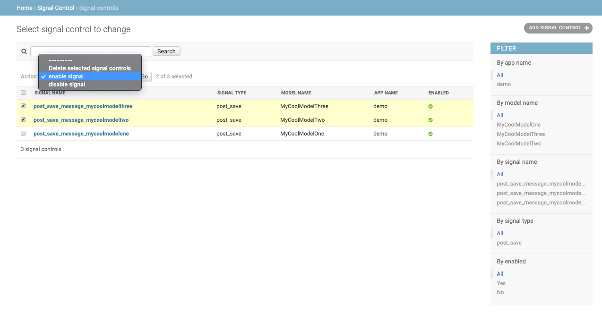

.. _features:

Features
========

This document details the features currently available in django-signalcontrol.

Signal Detection
----------------
Signals are scanned automatically when django starts. Any signal with signal_control applied will be detected and
automatically added (if not already present) in the SignalControl database table. An info message will be printed
when django starts if a new signal with signal_control is discovered. It will look like this:

``INFO: registering msg_after_my_model_save in my_app with SignalControl``

In this example, 'msg_after_my_model_save' is the name of the signal, and 'my_app' is the name of the django app.

The signal_control Decorator
----------------------------

SignalControl can be added to a signal with the provided decorator. In the signals.py file, import the signalcontrol
decorator and add the signal_control decorator to the line directly above the signal definition. Example:

.. code-block:: python

    from signalcontrol.decorators import signal_control

    @receiver(post_save, sender=MyCoolModel)
    @signal_control
    def msg_after_my_model_save(sender, instance, created, **kwargs):
        """ some signal """
        print('you just saved an instance of MyCoolModel')
..

Admin Interface
---------------

An django admin interface for django-signalcontrol is available to set signals to enabled or disabled. This displays
all model signals that can be controlled, and lists the application, model, signal receiver and signal name.
Additionally, full search is available and filters are available for each field.
Signals can be enabled or disabled individually or in bulk.

